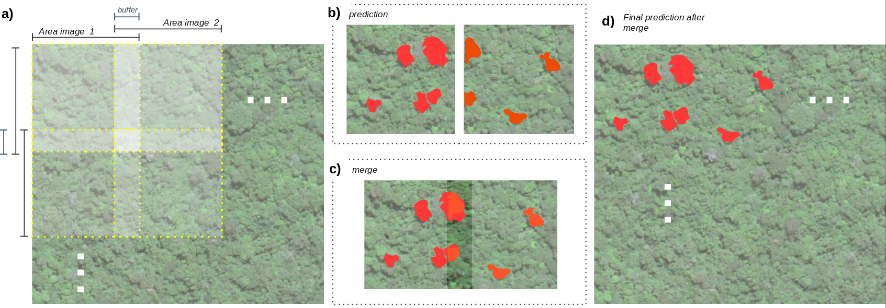

<p align="center">    
    <a href="https://github.com/Bioverse-Labs/deep-learning/issues" alt="Issues">
        </a>
    <a href="https://github.com/Bioverse-Labs/deep-learning/stargazers" alt="Stars">
        </a>
    <a href="https://github.com/Bioverse-Labs/deep-learning/forks" alt="Forks">
        </a>
    <a href="https://github.com/Bioverse-Labs/deep-learning/LICENCE.md" alt="Licence">
        </a>
    <a href='https://bioverse-dl.readthedocs.io/en/latest/?badge=latest'>
        </a>
    <a href="https://twitter.com/BioverseLabs" alt="Twitter">
        </a>
</p>

# Bioverse Labs (deep-learning module)
The deep-learning module incorporate essential procedures to prepare remote sensing images mostly for automatic classification methods, in this case specifically, deep-learning approaches. 

Beyond the routines, this code was prepared to have a personal use or even ready for adaptation to be run in server-side. The ain is to incorporate some of the main Deep Learning models for remote sensing image analysis and mapping. In this version, the following DL architectures were tested:
- [UNet](https://lmb.informatik.uni-freiburg.de/Publications/2015/RFB15a/)

**All modules available here are under construction. Therefore, many errors and malfunctions can occur for your specific needs.**

1. [Setting up your environment](#1-Setting-up-your-environment)
2. [Prepare your virtual environment](#2-Prepare-your-virtual-environment)
3. [Examples ](#3-Examples)
4. [TODO-list](#4-TODO-list)

# Setting up your Python environment
This command-line solution was mainly used for training and prediction of remote sensing images, which have a more dynamic use of image bandsLICENSE and wider radiometric values (normally, 16 bits), and was created to be permissive and easily extended on very similar purposes (remote sensing). Most of the methods and libraries presented, were used to solve these particular events, and certainly have a lot of other alternatives out there. Please, feel free to share and contribute. 

## Python version and OS
The `deep-learning` was developed using Python version 3.7+, and **Linux 20.4 LTS focal fossa** operational system. 

# Prepare your virtual environment
First of all, check if you have installed the libraries needed:
```
sudo apt-get install python3-env
```
then, in the
```
python -m venv .venv
```
and activates it:
```
source .venv/bin/activate
```
as soon you have it done, you are ready to install the requirements.

## Preparing your `.env` file
This library uses decoupling, which demands you to set up variables that is only presented locally, for instance, the path you want to save something, or the resources of your project. In summary, your environment variables. So, copy a paste the file `.env-example` and rename it to `.env`. Afterwards, just fill out each of the variables content within the file:
```
DL_DATASET=PATH_TO_TRAINING_FOLDER
```

## Installing `requirements.txt`
If you do not intent to use GPU, there is no need to install support to it. So, in requirements file, make sure to set `tensorflow-gpu` to only `tensorflow`. If everything is correct, and you **virtualenv** is activated, execute: 
```
pip install -r requirements.txt
```

The extra requeriments not listed in `requirements.txt`, is GDAL library, which has to be installed according to the version installed globally in your computer. So, pip have to address the same version during installation. The procedures of its dependencies can be found in `INSTALL_GDAL` in the root folder. 

In order to install GDAL, execute:
```
sudo apt install gcc g++ libxml2-dev libxslt1-dev zlib1g-dev
```
then,
```
sudo apt-get install gdal-bin libgdal-dev
```

With your virtual environment activated, run:
```
pip install GDAL==$(gdal-config --version | awk -F'[.]' '{print $1"."$2}')
```

It will automatically get your GDAL's version and it will pip install according to it. 

## The `settings.py` file:
This file centralized all constants variable used in the code, in particular, the constants that handle all the DL model. Thus, the Python dictionary `DL_PARAM` splits all the values and parameters by model type. In this case, only the UNet architecture was implemented:
```
DL_PARAM = {
    'unet': {
        'image_training_folder': os.path.join(DL_DATASET, 'samples', LABEL_TYPE),
        'annotation_training_folder': os.path.join(DL_DATASET, 'samples', LABEL_TYPE),
        'output_checkpoints': os.path.join(DL_DATASET, 'predictions', '256', 'weight'),
        'output_history': os.path.join(DL_DATASET, 'predictions', '256', 'history'),
        'save_model_dir': os.path.join(DL_DATASET, 'predictions', '256', 'model'),
        'tensorboard_log_dir': os.path.join(DL_DATASET, 'predictions', '256', 'log'),
        'pretrained_weights': 'model-input256-256-batch8-drop05-best.hdf5',
        'image_prediction_folder': os.path.join(DL_DATASET, 'test', 'big'),
        'output_prediction': os.path.join(DL_DATASET, 'predictions', '256', 'inference'),
        'output_prediction_shp': os.path.join(DL_DATASET, 'predictions', '256', 'shp'),
        'tmp_slices': os.path.join(DL_DATASET, 'tmp', 'tmp_slice'),
        'tmp_slices_predictions': os.path.join(DL_DATASET, 'tmp', 'tmp_slice_predictions'),
        'input_size_w': 256,
        'input_size_h': 256,
        'input_size_c': 3,
        'batch_size': 8,
        'learning_rate': 0.0001,
        'filters': 64,
        'kernel_size': 3,
        'deconv_kernel_size': 3,
        'pooling_size': 2,
        'pooling_stride': 2,
        'dropout_rate': 0.5,
        'epochs': 500,
        'classes': {
                "other": [0, 0, 0],
                "nut": [102, 153, 0],
                "palm": [153, 255, 153]
        },
        'color_classes': {0: [0, 0, 0], 1: [102, 153, 0], 2: [153, 255, 153]},
        'width_slice': 256,
        'height_slice': 256
    }
}
```
in this way, if a new model is introduced to the code, a new key is add to this dictionary with its respective name, then, it will automatically load all the parameters according to the type of mode the user choose in the `-model` command-line option. 


## The hierarchy of folders:
It is very recommended to prepare the hierarchy of folders as described in this section. When the training samples are build, as described in [bioverse image-processing](https://github.com/Bioverse-Labs/image-processing), four main folders are created: one for raster, one for the annotation (i.e. ground-truth, label, reference images), one to save the predictions (i.e. inferences), and finally one to store the validation samples. Besides, in order to conduct multiple test, such as different dimensions and classes of training samples, subfolders are also created under each folder, such as:

```
samples
│   └── classid
│      ├── training
│      │   ├── image
|      │   |    :: images in TIF extension
│      │   ├── label
|      │   |    :: annotation in PNG extension
│      └── validation
│      │   ├── image
|      │   |    :: images in PNG extension
│      │   ├── label
|      │   |    :: annotation in PNG extension
├── predictions
│   └── 256
│       ├── history
│       ├── inference
│       └── weight
│       ├── model
│       └── log
```

This suggestion of folder hierarchy is not mandatory, just make sure the paths is correctly pointed in `settings.py` file.


## NVIDIA's driver and CUDA for Ubuntu 20.4
For most of the processing and research approaching Deep Learning (DL) methodologies, a certain computational power is needed. Recently, the use of GPUs has expanded the horizon of heavy machine learning processing such as the DL demands. 

TensorFlow GPU support requires an assortment of drivers and libraries. To simplify installation and avoid library conflicts, the TensorFlow recommends the use of a [TensorFlow Docker Image](https://www.tensorflow.org/install/docker), which incorporates all the setups needed to this kind of procedure. For more details, please, access the [TensorFlow official page](https://www.tensorflow.org/install/gpu).

Considering not using a Docker image, there are many tutorials in how to install your NVIDIA's driver and CUDA toolkit, such as described in [Google Cloud](https://cloud.google.com/compute/docs/gpus/install-drivers-gpu#ubuntu-driver-steps), [NVIDIA Dev](https://developer.nvidia.com/cuda-downloads), or even a particular pages. The way presented here, could vary in your need. So, if you want to prepare your environment based in a complete different OS or architecture, just follow the right steps in the provider website, and make sure to have all the cuda libraries listed in `LD_LIBRARY_PATH`.

So, for Linux OS, x86_64 arch, Tensorflow 2.1+, and Ubuntu LTS 20.04, first, it is necessary to install all software requirements, which includes: 
- NVIDIA® GPU drivers — CUDA® 10.1 requires 418.x or higher.
- CUDA® Toolkit — TensorFlow supports CUDA® 10.1 (TensorFlow >= 2.1.0)
- CUPTI ships with the CUDA® Toolkit.
- cuDNN SDK 7.6
- (Optional) TensorRT 6.0 to improve latency and throughput for inference on some models.

to install CUDA® 10 (TensorFlow >= 1.13.0) on Ubuntu 16.04 and 18.04. These instructions may work for other Debian-based distros.
```
wget https://developer.download.nvidia.com/compute/cuda/repos/ubuntu2004/x86_64/cuda-ubuntu2004.pin
sudo mv cuda-ubuntu2004.pin /etc/apt/preferences.d/cuda-repository-pin-600
wget https://developer.download.nvidia.com/compute/cuda/11.0.3/local_installers/cuda-repo-ubuntu2004-11-0-local_11.0.3-450.51.06-1_amd64.deb
sudo dpkg -i cuda-repo-ubuntu2004-11-0-local_11.0.3-450.51.06-1_amd64.deb
sudo apt-key add /var/cuda-repo-ubuntu2004-11-0-local/7fa2af80.pub
sudo apt-get update
sudo apt-get -y install cuda
```
then, reboot the system.

As mentioned before, TensorFlow will seek for some of the CUDA libraries during training. As reported by many users, is possible that some of them is installed in different location in your filesystem. To guarantee your `LD_LIBRARY_PATH` is pointing out to the right folder, add the 

If you followed all steps and have it installed properly, then, the final steps is  So, add the following lines to your `~\.bashrc` file using `nano` or any other editor (check the version to replace on `XXX`):
```
export PATH=/usr/local/cuda-XXX/bin${PATH:+:${PATH}}
export LD_LIBRARY_PATH=/usr/local/cuda-XXX/lib64${LD_LIBRARY_PATH:+:${LD_LIBRARY_PATH}}
```
right after, updated it:
```
source ~/.bashrc
```

If you followed all steps and have it installed properly, you are ready to train your model!

> For more details, follow the issue reported [here](https://stackoverflow.com/questions/60208936/cannot-dlopen-some-gpu-libraries-skipping-registering-gpu-devices) and [here](https://askubuntu.com/questions/1145946/tensorflow-wont-import-with-sudo-python3).

# Examples 
## Training the model:
After to validate all paths and parameters in `settings.py`, the training could be performed with the following command line:
```
python main.py -model unet -train True -predict False -verbose True
```
the runtime logging will print something like (note that all CUDA libraries must to be all loaded correctly, otherwise, it will not be registered and then CPU is used):
```
(.venv) user@user-machine:~/deep-learning$ python main.py -model unet -train True -predict False -verbose True
2020-09-23 20:43:31.621367: I tensorflow/stream_executor/platform/default/dso_loader.cc:48] Successfully opened dynamic library libcudart.so.10.1
[2020-09-23 20:43:42] {main.py        :63  } INFO : Starting process... 
[2020-09-23 20:43:42] {main.py        :39  } INFO : >> UNET model selected... 
[2020-09-23 20:43:42] {unet.py        :19  } INFO : >>>> Settings up UNET model... 
2020-09-23 20:43:43.281992: I tensorflow/stream_executor/platform/default/dso_loader.cc:48] Successfully opened dynamic library libcuda.so.1
2020-09-23 20:43:43.654774: I tensorflow/stream_executor/cuda/cuda_gpu_executor.cc:982] successful NUMA node read from SysFS had negative value (-1), but there must be at least one NUMA node, so returning NUMA node zero
2020-09-23 20:43:43.655488: I tensorflow/core/common_runtime/gpu/gpu_device.cc:1716] Found device 0 with properties: 
pciBusID: 0000:00:04.0 name: Tesla P4 computeCapability: 6.1
coreClock: 1.1135GHz coreCount: 20 deviceMemorySize: 7.43GiB deviceMemoryBandwidth: 178.99GiB/s
2020-09-23 20:43:43.655531: I tensorflow/stream_executor/platform/default/dso_loader.cc:48] Successfully opened dynamic library libcudart.so.10.1
2020-09-23 20:43:43.655713: W tensorflow/stream_executor/platform/default/dso_loader.cc:59] Could not load dynamic library 'libcublas.so.10'; dlerror: libcublas.so.10: cannot open shared object file: No such file or directory
2020-09-23 20:43:44.191179: I tensorflow/stream_executor/platform/default/dso_loader.cc:48] Successfully opened dynamic library libcufft.so.10
2020-09-23 20:43:44.398087: I tensorflow/stream_executor/platform/default/dso_loader.cc:48] Successfully opened dynamic library libcurand.so.10
2020-09-23 20:43:45.234487: I tensorflow/stream_executor/platform/default/dso_loader.cc:48] Successfully opened dynamic library libcusolver.so.10
2020-09-23 20:43:45.458019: I tensorflow/stream_executor/platform/default/dso_loader.cc:48] Successfully opened dynamic library libcusparse.so.10
2020-09-23 20:43:46.809363: I tensorflow/stream_executor/platform/default/dso_loader.cc:48] Successfully opened dynamic library libcudnn.so.7
2020-09-23 20:43:46.809421: W tensorflow/core/common_runtime/gpu/gpu_device.cc:1753] Cannot dlopen some GPU libraries. Please make sure the missing libraries mentioned above are installed properly if you would like to use GPU. Follow the guide at https://www.tensorflow.org/install/gpu for how to download and setup the required libraries for your platform.
Skipping registering GPU devices...
2020-09-23 20:43:46.809732: I tensorflow/core/platform/cpu_feature_guard.cc:142] This TensorFlow binary is optimized with oneAPI Deep Neural Network Library (oneDNN)to use the following CPU instructions in performance-critical operations:  AVX2 FMA
To enable them in other operations, rebuild TensorFlow with the appropriate compiler flags.
2020-09-23 20:43:47.219185: I tensorflow/core/platform/profile_utils/cpu_utils.cc:104] CPU Frequency: 2300000000 Hz
2020-09-23 20:43:47.220090: I tensorflow/compiler/xla/service/service.cc:168] XLA service 0x27b8e30 initialized for platform Host (this does not guarantee that XLA will be used). Devices:
2020-09-23 20:43:47.220121: I tensorflow/compiler/xla/service/service.cc:176]   StreamExecutor device (0): Host, Default Version
2020-09-23 20:43:47.237334: I tensorflow/core/common_runtime/gpu/gpu_device.cc:1257] Device interconnect StreamExecutor with strength 1 edge matrix:
2020-09-23 20:43:47.237365: I tensorflow/core/common_runtime/gpu/gpu_device.cc:1263]      
[2020-09-23 20:43:48] {unet.py        :74  } INFO : >>>> Done! 
Found 2636 images belonging to 1 classes.
Found 2636 images belonging to 1 classes.
Epoch 1/500
 4/50 [=>............................] - ETA: 2:40 - loss: 0.6931 - accuracy: 0.8943
...
```

The model as well as the history of training (with accuracy, losses, and other metrics evolution), will be saved in the paths indicated in `settings.py`.

## Predicting with an existent weight:

First of all, make sure the `.hdf5` weight file is correctly set in `pretrained_weights` network's parameter. After to validate all other paths in `settings.py`, the inferences/predictions could be performed with the following command line:
```
python main.py -model unet -train False -predict True -verbose True
```

The prediction procedure involve two types: (i) for images where the dimension is equal to the samples's dimensions used during training, and (ii) images where the dimension is larger. Besides, the inferences have two classes of images, the images without any geographic information, and images with geographic information. The difference is that for images with no geographic metadata, the poligonization (the process to convert PNG prediction in SHP shapefiles - geographic vectors), **will not** be performed.  

> In this section, we focus specifically how the (ii) was implemented.   

Considering a large geographic image as an example, in the figure below is shown how the inference is made. First (a), the large image is tilled in a way that each tile have the same dimension as it was trained. 



In order to prevent discontinuous predictions between each tile, a buffer is applied (see (a)). The buffer can be configured also in `settings.py`, with the `BUFFER_TO_INFERENCE` variable, where the integer value represents the number of pixels to apply the buffering. In this way, zero will perform the inferences without buffering. The maximum buffering value is the half of each tile's dimension.

After to predict, each tile will have a correspondent segmentation (see (b)). After to predict every single tile that compose the image, the predictions are then merged (c). Due to the buffering, the discontinuity is minimized during merging. Finally, getting a more consistent map in the end (d).

> The predictions in PNG will be placed in `output_prediction`. If it is a large image, then it will be place the tile's predictions first in `tmp_slices_predictions`, then, the merging procedure will select all tiles and place the merged predictions in `output_prediction`. When done, the poligonization is performed (only for geographic files). The final vector file is place in `output_prediction_shp`. 

# TODO-list
This source-code is being released for specific applications, and for those who probably has similar needs. For this reason, we still have a lot to do in terms of unit tests, python conventions, optimization issues, refactoring, so on! So, Feel free to use and any recommendation or PRs will be totally welcome!

```
-- ~~refactor docstring~~
-- include alternative to the set of dl models:
    --- ~~unet~~
    --- pspnet
    --- deeplabv3+
    --- segnet
-- ~~finish inferece procedure~~:
    --- ~~single image~~
    --- ~~multiple images~~
    --- ~~dynamic resolution~~
-- unittest over basic methods: filesystem/IO, organization, params
```

